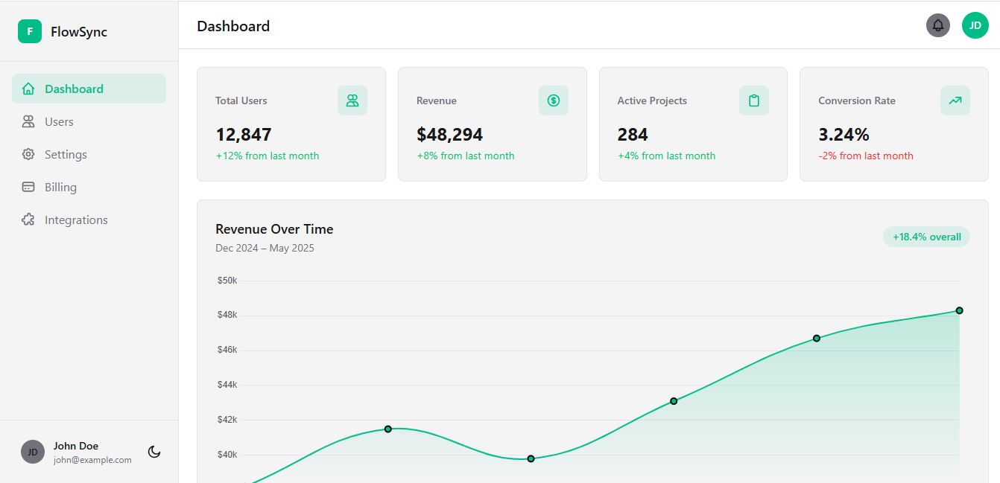
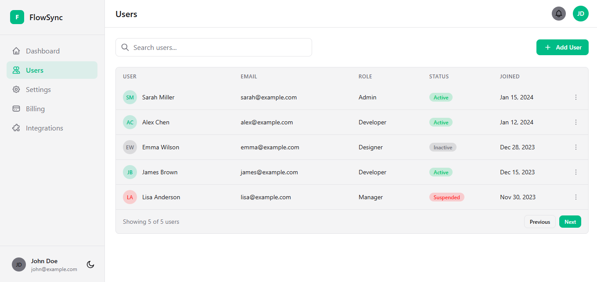
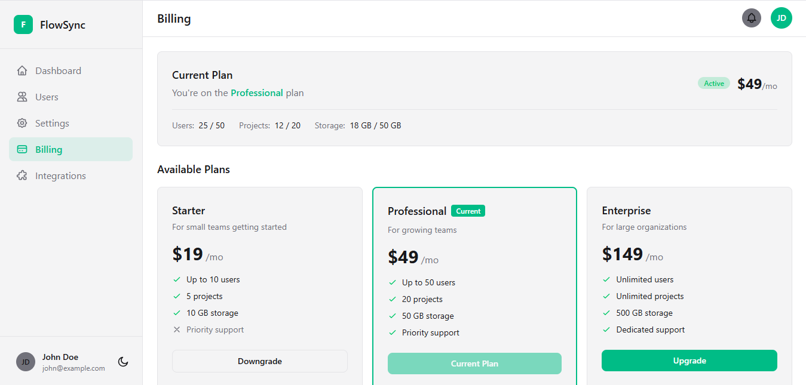
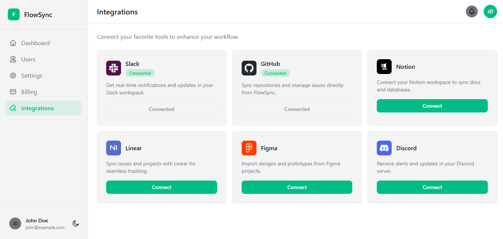

# FlowSync

FlowSync is a clean admin dashboard demo focused on user management, billing, and integrations. It is a frontend sample project designed to demonstrate responsive layouts, a themeable UI, and interactive dashboard components.

**[Live demo](https://flowsync3.netlify.app/)**



## About

This project is a frontend-only prototype with mocked data, created to showcase a polished admin interface. It includes several common SaaS screens:

- dashboard analytics
- user and role management
- subscription billing overview
- integration status and controls
- account settings with theme switching

Dark mode is supported throughout the interface, and the layout adapts cleanly from desktop to mobile.

## Features

- Dashboard with summary cards and revenue charts powered by Chart.js
- Searchable user list with role and status indicators
- Billing screen with plan details and usage metrics
- Integrations page showing linked services and connection status
- Settings area for profile, password, and notification preferences
- Dark mode support with persisted theme choice
- Responsive sidebar and mobile-friendly page structure

## Tech stack

- HTML5
- Vanilla JavaScript
- Tailwind CSS v4
- Chart.js

## Screenshots

| Dashboard | Users |
|---|---|
|  |  |

| Billing | Integrations |
|---|---|
|  |  |

## Running locally

The site is static and does not require a build step.

1. Clone or download the repository.
2. Open `index.html` in a browser, or run a simple local server.

For example:

```bash
npx serve .
```

Then visit `http://localhost:3000` (or the address shown by the server).

## Author

Created by [Gustavo González](https://github.com/Dev-Gus).